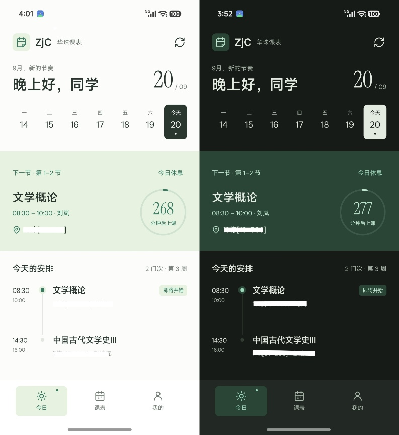
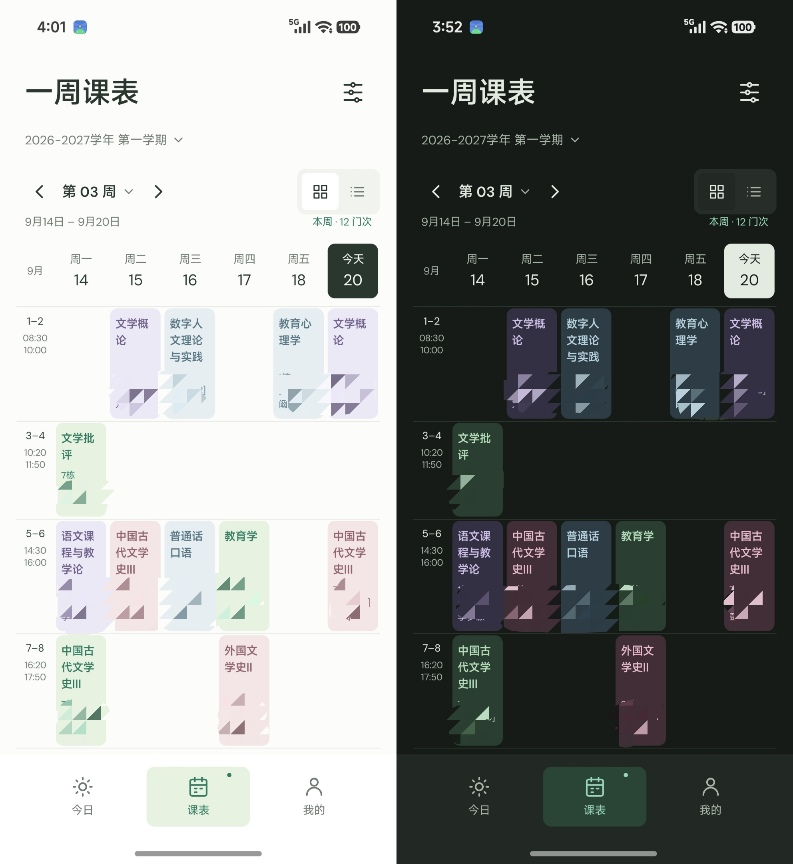
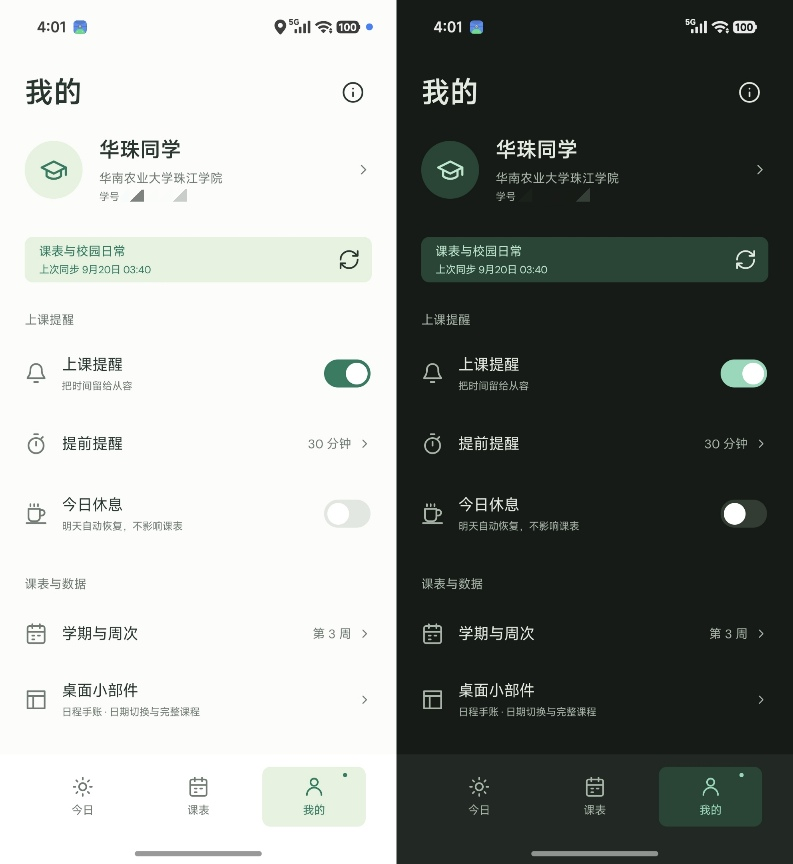
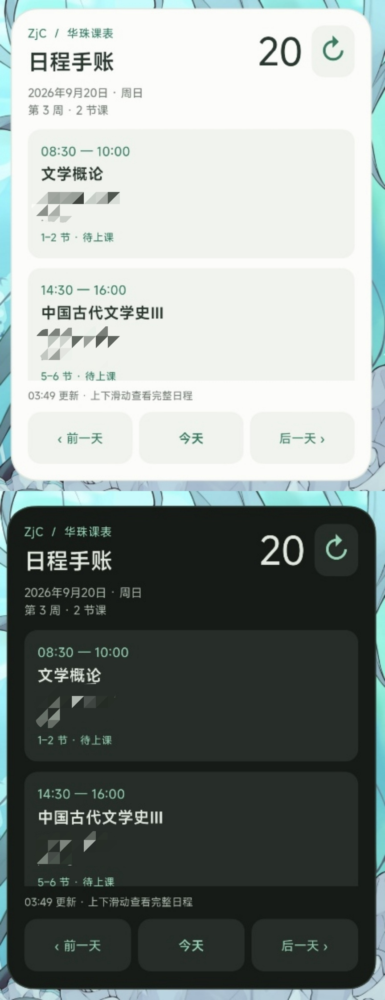
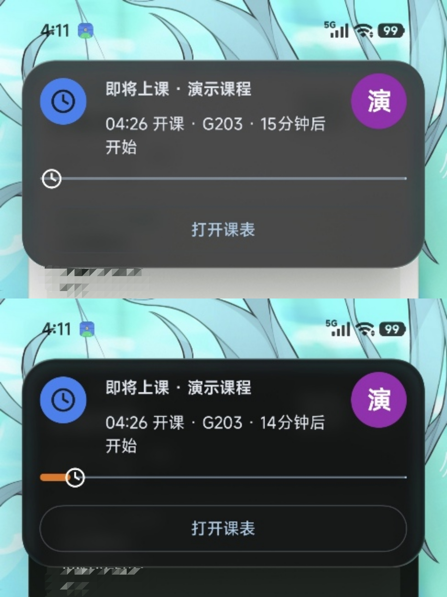
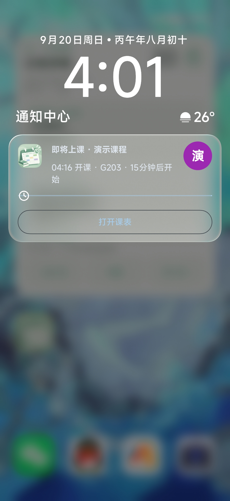

<div align="center"><h1>华珠课表 · ZjC-Course-Alert</h1></div>

<p align="center">
  
</p>

<p align="center">
  <b>专为华南农业大学珠江学院学子打造的现代化校园课表应用</b><br>
  极简美学 · 离线手账质感 · 准时课前提醒 · 优雅桌面小组件
</p>

<p align="center">
  
  
  
  
  
</p>

---

> ⚠️ **声明**：本项目为第三方开源客户端，仅供个人学习与日常日程管理使用。非学校或喜鹊儿（kingsoft教务系统）官方出品，不收集、不上传任何个人数据至第三方服务器。

---

## ✨ 核心特性

### 🌿 极简雅致，拒绝臃肿
- **现代美学排版**：告别杂乱的校园广告与信息流，回归纯粹日程。
- **莫兰迪低饱和配色**：精心调校的温润护眼色系，同课程同教师全局自动锁定同一色彩。
- **自适应深浅色模式**：白昼如纸张温润，暗夜如静谧墨水，全天候舒适阅读。

### ⏰ 华珠真实作息与周次严格对齐
- **专属时间槽位**：内置华珠真实作息网格（上午 8:30 起步、大课连上规则、晚间作息等），卡片严格占满节次格，告别时间轴压扁或空白错位。
- **复杂周次精准解析**：完整支持单双周、区间周与跳周（如 `1-5,7-17周`），绝不漏课、不错周。
- **周末动态展开**：周一至周五精致平铺；仅当周末有课时自动展开对应星期列，最大化工作日可视空间。

### 📌 经典桌面手账小组件
- **原生 RemoteViews 架构**：秒级载入，杜绝白屏与无限加载死锁。
- **支持自由拉伸**：支持从 `4×4`（约显示1~2门课程）拉伸到 `4×7` 及以上长度，可见课程更多
- **下节课高亮引导**：醒目指示下一节课时间、教室与名称，抬手即知去哪上课。

### 🔔 准时守信的后台提醒
- **底层精准闹钟（Exact Alarm）**：提前 5~30 分钟自由配置，准点唤醒通知。
- **一键「今日休息」**：突发调休、请假或放假时，轻点卡片即刻静音当天所有提醒，跨过零点自动恢复。
- **支持日历导出（ICS）**：一键将全学期课表导出为标准日历文件，无缝导入系统日历或分享给好友。

---

> **注**：预览图部分内容已打码，可能影响视觉观感

## 📱 界面预览

<table align="center">
  <tr>
    <td align="center" width="33%">
      
      <br /><b>今日日程 · 灵动倒计时</b>
    </td>
    <td align="center" width="33%">
      
      <br /><b>周课表 · 莫兰迪网格</b>
    </td>
    <td align="center" width="33%">
      
      <br /><b>个人设置 · 快捷功能矩阵</b>
    </td>
  </tr>
</table>

## 📱 桌面小组件与通知预览

<table align="center">
  <tr>
    <td align="center" width="18%">
      
      <br /><b>桌面小组件 · 抬手即看</b>
    </td>
    <td align="center" width="33%">
      
      <br /><b>原生实时通知 · 类灵动岛体验</b>
    </td>
    <td align="center" width="21%">
      
      <br /><b>通知中心预览 · 准时提醒</b>
    </td>
  </tr>
</table>

---

## 🚀 快速上手

### 1. 下载安装
前往本仓库的 [Releases 页面](../../releases) 下载最新版的 `华珠课表-release.apk` 即可直接安装。

### 2. 首次登录
1. 打开应用，输入你的**教务学号**与**密码**（即喜鹊儿 App 登录凭据）。
2. 点击「登录并同步」，应用将通过内置安全协议自动拉取当前学期的课程与作息。
3. 按照向导指引开启**通知**与**精确闹钟**权限，即可享受无忧上课提醒。

> 💡 **提示**：教务网络仅在学校教务系统正常运行时可连通同步；课表拉取成功后会持久化储存在本地，**无网状态下亦可离线秒开查看**，无需烦恼喜鹊儿app原生的加载慢问题。

> ⚠️ **提醒**：如使用app自带的`类灵动岛通知（即安卓原生的实时通知）`,请务必给予实时通知权限`（澎湃OS：长按应用-应用详情-通知管理-焦点通知/实时动态，开启）`，并允许app**后台无限制**，否则app很有可能无法使用。

> ⚠️ **提醒**：关于**桌面小组件**，首次添加到桌面后需要用户手动停止app运行一次后，再打开app，桌面小组件才能正确显示内容。

---

## 🔒 隐私与安全性

- **密码与凭据**：仅保存在手机本机的 `EncryptedSharedPreferences`（基于 Android Keystore 硬件级加密），绝不上报任何私有服务器。
- **纯粹开源**：代码 100% 透明开源，无热更新下发、无内嵌第三方统计或商业广告 SDK。
- **权限最小化**：仅申请网络请求（拉取课表）、通知（上课提醒）、精确闹钟（准时调度）等必需权限。

---

## 🛠️ 本地开发与构建

本项目使用标准的 Android Gradle 构建体系：

```bash
# 克隆仓库
git clone https://github.com/Rentz412/ZjC-Course-Alert.git
cd ZjC-Course-Alert

# 运行全量单元测试（协议签名固定向量、周次区间算法等）
./gradlew testDebugUnitTest

# 编译 Debug 测试包
./gradlew assembleDebug

# 编译 Release 生产优化包（启用 R8 混淆压缩与内联优化）
./gradlew assembleRelease
```

- **Android SDK**：Min SDK 26 (Android 8.0) · Target SDK 37
- **核心组件**：Kotlin 2.4 · Jetpack Compose · Room Database · WorkManager · OkHttp 5

---

## 🤝 鸣谢与致敬

- 感谢上游开源项目 [HuanLinOTO/GBU-Course-Alert](https://github.com/HuanLinOTO/GBU-Course-Alert) 提供的优秀课表应用架构灵感与基础骨架。
- 感谢开源字体社区与各类开源矢量图标提供的美学支持。

---

## 📄 开源许可证

本项目基于 [Apache License 2.0](LICENSE) 开源。
Copyright © 2026 Rentz. All rights reserved.
